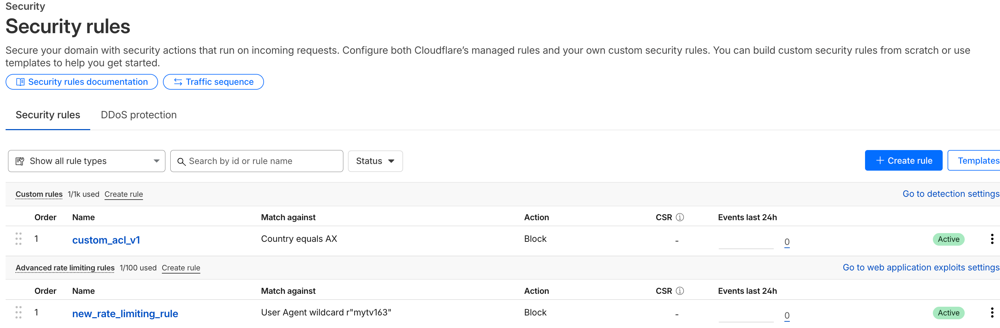

# Cloudflare Terraform Rules Demo

这个项目使用 Terraform 管理 Cloudflare 的安全规则和速率限制规则，采用现代化的配置方式，包括动态 phase 管理和自动发现功能。

## 文件结构

- `provider.tf` - Terraform provider 配置
- `variables.tf` - 变量定义
- `data.tf` - 数据源配置，用于自动发现现有 rulesets 和 phases
- `ruleset.tf` - 主要的规则集配置
- `terraform.tfvars` - 实际的变量值（包含敏感信息，不应提交到版本控制）
- `terraform.tfvars.example` - 变量值模板
- `.gitignore` - Git 忽略文件配置
- `README.md` - 项目文档

## 配置的规则

### 1. Zone Custom Firewall Rules
- **功能**: 阻止来自 AX 国家的流量
- **响应**: 返回 403 状态码和自定义消息 "go away"
- **可见性**: 直接在 Cloudflare Security Rules 界面中可见
- **Phase**: `http_request_firewall_custom`

### 2. Rate Limiting Rules
- **功能**: 针对 mytv163 user agent 的速率限制
- **限制**: 15 秒内最多 10 个请求
- **特征**: 基于 colocation ID 和源 IP 进行限制
- **动作**: 超出限制时阻止请求
- **Phase**: `http_ratelimit`

### 3. Managed Rules Exception
- **功能**: 为来自 AX 国家的流量跳过托管 WAF 规则
- **动作**: 使用 `skip` 动作和 `ruleset: current` 参数
- **用途**: 允许特定流量绕过 Cloudflare 的托管 WAF 规则
- **Phase**: `http_request_firewall_managed`
- **参考**: [Cloudflare WAF Managed Rules](https://developers.cloudflare.com/waf/managed-rules/)

**功能说明**:
- `action: "skip"` - 跳过规则执行
- `ruleset: "current"` - 跳过当前 ruleset 中的所有规则
- 适用于需要为特定条件禁用托管规则的场景

**API 示例**:
```bash
curl "https://api.cloudflare.com/client/v4/zones/16f5c56c08ee93201e2733253570385b/rulesets/27392cc1822f43b3b2809bb9bf2619e4/rules" \
  -H "Authorization: Bearer $CF_AUTH_TOKEN" \
  -d '{
    "action": "skip",
    "action_parameters": {"ruleset": "current"},
    "description": "audo-custom-deploy-managed-rules",
    "expression": "(ip.src.country eq \"AX\")"
  }'
```

## 高级功能

### 动态 Phase 管理
项目使用数据源和本地值来动态管理 Cloudflare phases，而不是硬编码字符串：

```hcl
# 本地值定义常用的 phases
locals {
  phases = {
    custom_firewall  = "http_request_firewall_custom"
    managed_firewall = "http_request_firewall_managed"
    rate_limit      = "http_ratelimit"
    ddos_l7         = "ddos_l7"
    transform       = "http_request_transform"
    origin          = "http_request_origin"
    cache_settings  = "http_request_cache_settings"
  }
}

# 使用本地值而不是硬编码字符串
resource "cloudflare_ruleset" "example" {
  phase = local.phases.custom_firewall  # 而不是 "http_request_firewall_custom"
}
```

### 自动发现现有 Rulesets
使用数据源自动发现和管理现有的 managed rulesets：

```hcl
# 数据源获取现有 rulesets
data "cloudflare_rulesets" "managed_rulesets" {
  zone_id = var.cloudflare_zone_id
}

# 自动找到现有的 managed WAF ruleset
locals {
  managed_waf_ruleset = [
    for ruleset in data.cloudflare_rulesets.managed_rulesets.rulesets : ruleset
    if ruleset.phase == local.phases.managed_firewall && ruleset.kind == "zone"
  ][0]
}
```

### 可用 Phases 和 Rulesets 查看
运行 `terraform apply` 后，你可以看到：

**所有可用的 phases**:
- `http_request_origin`
- `http_request_firewall_custom`
- `http_request_firewall_managed`
- `http_ratelimit`
- `ddos_l7`
- `http_response_headers_transform`
- `http_request_cache_settings`
- `http_request_sanitize`
- `http_response_firewall_managed`

**Managed rulesets 信息**:
- Cloudflare Managed Ruleset
- Cloudflare OWASP Core Ruleset
- DDoS L7 ruleset
- Cloudflare Sensitive Data Detection
- 等等...

### 技术优势
1. **可维护性** - 集中管理 phase 名称
2. **可发现性** - 自动发现可用的 phases 和 rulesets
3. **类型安全** - 减少拼写错误
4. **动态性** - 自动适应 Cloudflare 的更新
5. **可扩展性** - 易于添加新的规则和配置

## 使用方法

1. **复制变量模板文件**：
   ```bash
   cp terraform.tfvars.example terraform.tfvars
   ```

2. **编辑 `terraform.tfvars` 文件，填入你的实际值**：
   ```hcl
   cloudflare_api_token = "your_actual_api_token"
   cloudflare_zone_id   = "your_actual_zone_id"
   ```

3. **初始化 Terraform**：
   ```bash
   terraform init
   ```

4. **查看执行计划**：
   ```bash
   terraform plan
   ```

5. **应用配置**：
   ```bash
   terraform apply
   ```

6. **查看输出信息**：
   ```bash
   terraform output
   ```

## API Token 权限要求

为了成功管理 Cloudflare 规则集，你的 API Token 需要以下权限：

- **Zone > Zone WAF** 权限（或更广泛的权限）
- **Zone > Zone** 权限（用于读取 zone 信息）

创建 API Token 时，请确保：
1. 在 Cloudflare Dashboard 中访问 "My Profile" > "API Tokens"
2. 点击 "Create Token"
3. 选择 "Custom token" 模板
4. 添加以下权限：
   - Zone:Zone WAF:Edit
   - Zone:Zone:Read
5. 指定适当的 Zone Resources（可以选择特定 zone 或所有 zone）


**注意**: 这些 API 调用代表了上述所有更改。需要具有 `Zone > Zone WAF` 或更广泛权限的 API Token。

## 安全注意事项

- `terraform.tfvars` 文件包含敏感信息，已添加到 `.gitignore` 中
- API Token 应该具有适当的权限范围
- 建议使用环境变量或 Terraform Cloud 来管理敏感变量
- 定期轮换 API Token 以提高安全性

## 变量说明

- `cloudflare_api_token` - Cloudflare API Token（必需，敏感）
- `cloudflare_zone_id` - Cloudflare Zone ID（必需）
- `cloudflare_account_id` - Cloudflare Account ID（可选，用于账户级资源）

## 故障排除

### 常见问题

1. **"exceeded maximum number of zone rulesets" 错误**
   - 原因：每个 phase 只能有一个 zone-level ruleset
   - 解决：导入现有的 zone ruleset 或删除冲突的 ruleset

2. **"missing cf.colo.id" 错误**
   - 原因：Rate limiting 规则必须包含 `cf.colo.id` 特征
   - 解决：确保 `characteristics` 数组包含 `["cf.colo.id", "ip.src"]`

3. **权限不足错误**
   - 原因：API Token 权限不足
   - 解决：检查并更新 API Token 权限

### 调试命令

```bash
# 查看当前状态
terraform show

# 查看特定资源
terraform state show cloudflare_ruleset.zone_custom_firewall_entrypoint

# 刷新状态
terraform refresh

# 查看输出
terraform output available_phases
terraform output managed_rulesets_info
```

## 贡献

欢迎提交 Issue 和 Pull Request 来改进这个项目。

## 许可证

本项目采用 MIT 许可证。